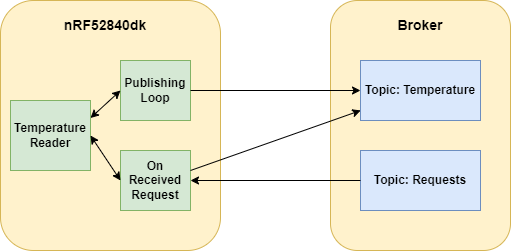
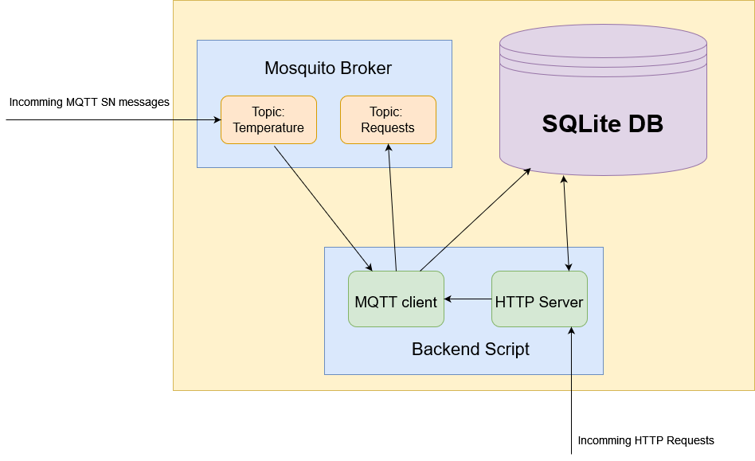
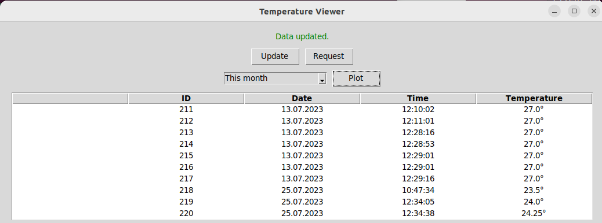
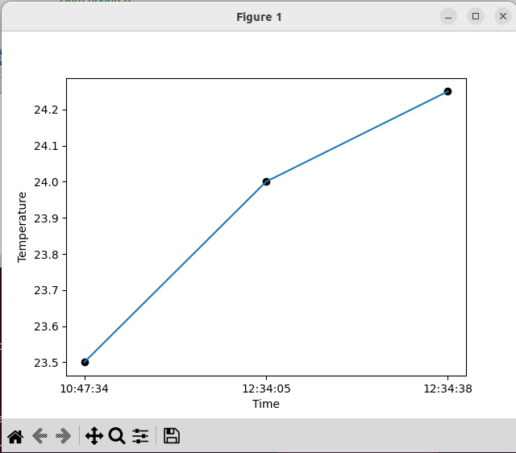
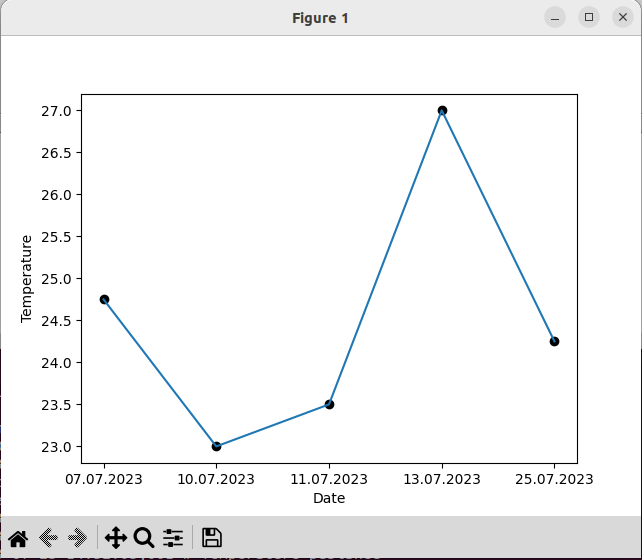

<br>
<br>

<div style="text-align: center;">
  
</div>

<br>
<br>
<br>

<div style="text-align: center;">
  <font size="5"><strong>Project Report</strong></font>
</div>

<br>
<br>
<br>

<div style="text-align: center;">
  <font size="5">Project: Digitalization SS 2023</font>
</div>
<br>
<div style="text-align: center;">
  <font size="6.9">IoT - From the Microcontroller to the Cloud</font>
</div>

<br>
<br>
<br>

<div style="text-align: center;">
  <font size="3"><em>by</em></font>
</div>
<br>
<br>
<div style="text-align: center;">
  <font size="4">Alexander Atanassov</font>
  <br>
  <font size="3"><em>and</em></font>
  <br>
  <font size="4">Binyam Tekeste</font>
</div>

<br>
<br>

<div style="text-align: center;">
  <font size="3"><strong>Supervisor</strong></font>
  <br>
  <font size="4">Prof. Dr. Oliver Hahm</font>
</div>

<br>
<br>

<div style="text-align: center;">
  <font size="3"><strong>Submission Date</strong></font>
  <br>
  <font size="4">July 28th, 2023</font>
</div>


<div style="page-break-after: always"></div>

**Table of Contents**

- [Overview](#overview)
- [Set Up](#set-up)
  - [Virtual Machine](#virtual-machine)
  - [Border Router](#border-router)
  - [Sensor Node](#sensor-node)
  - [Cloud](#cloud)
  - [User Interface](#user-interface)
- [Start The System](#start-the-system)
- [Sources](#sources)


<div style="page-break-after: always"></div>

# Overview

**Project description:**

The goal of the project is to create a system where sensor data can be send from a microcontroller to a cloud. The data should be send every *x* (e.g. 60) seconds and must be stored at the cloud. Also a user interface should be implemented where the data can be visualized. The UI must run on any local PC. The user should also be able to send commands back to the sensor node (e.g. request the sensor data immediately).

**System architecture:**


<br>
The system consists of three main parts:

- The first part is responsible for sending the sensor data to the cloud. It consists of a *nrf52840dk* board which captures the data and send it to the cloud using MQTT-SN protocol, a *nrf52840dongle* as a border router to route the packets between a 6Lo network and a normal IPv6 network and a Linux system with IPv6 connection to forwards the packets.
- The second part is the cloud. It consists of a MQTT broker as a middleware between the sensor node and the backend script. The backend script is responsible for storing the data into a SQLITE database and sending it to the end user.
- The last part is the user interface which is a desktop program and can run on any PC with IPv6 connection.


# Set Up

In this chapter all of the system components will be explained. For each component there will be a guide how to set it up.

## Virtual Machine

**Overview:**

For this project, a Linux operating system is required. It can be either be a host system or a guest system in a virtual machine. The machine on which Linux is running is used to forward IPv6 packets from the the sensor node to the cloud and back. It is also used for implementation tasks, connecting with the boards, monitoring the board terminal and debugging tasks. If a Linux system is already installed, the VirtualBox installation can be skipped. 

**Set up:**

The following steps will explain how to set up an Ubuntu virtual machine. After that, it will be explained what configurations have to be done and what software have to be installed.

***Virtual box and Ubuntu installation:***

1. Install [VirtualBox and the extension pack](https://www.virtualbox.org/wiki/Downloads).
2. Download an [Ubuntu Desktop](https://ubuntu.com/download/desktop) image.
3. Follow the [tutorial](https://www.geeksforgeeks.org/how-to-install-ubuntu-on-virtualbox/) to create a Ubuntu virtual machine.
4. Install the [Guest Additions](https://www.youtube.com/watch?v=zdkl16oAS1k&t=8s).

***Configurations and installations:***

1. Allow IPv6 forwarding.
    - Open the file ```/etc/sysctl.conf```
    - Make sure that the forwarding is enabled
        ```
        net.ipv6.conf.all.forwarding=1
        ```
2. Set up a wireguard IPv6 connection
    - Install wireguard
        ```
        sudo apt install wireguard
        ```
    - Set up a new wireguard connection using e.g. Advanced Network Configuration
    - Add the connection details:
        ```
        [Interface]
        PrivateKey = ****************************************
        Address = 2001:470:7347:c200:1000::/64 

        [Peer]
        PublicKey = OzafSSqhtZDkHLgSIXY6a3n6Yi4EK9W3npfbWKA0VFc=
        AllowedIPs = ::/0 
        Endpoint = 176.9.132.254:51820
        PersistentKeepAlive = 60
        ```
3. To be able to flash programs on the boards, the following software has to be installed:
   - J-Link
   - gcc-multilib
   - arm-none-eabi-gcc
   - openocd
   - nrfjprog
   - nrf-udev
   - nrfutil
4. Clone the RIOT repository,
   ```
   git clone git@github.com:RIOT-OS/RIOT.git
   ```
5. Clone this project.
   ```
   git clone https://github.com/alllexander1/IoTProject.git
   ```

## Border Router

**Overview:**

The border router is used to route packets between the sensor node and the internet. This component is necessary because the sensor node cannot directly send packets to the internet, since it is in a 6Lo network. The border router routes the packets between a 6Lo network and a 'normal' IPv6 network. It has two interfaces: A downstream to run 6LoWPAN and an IPv6 uplink. The program is based on the "gnrc_border_router" example program with small modifications so it can run on a *nrf52840dongle*.


**Set up:**

1. Open the Makefile of the *Border Router* program. 
2. Set the path to the RIOT directory corectly.
   ```
   RIOTBASE ?= $<Path to RIOT>
   ```
3. Set the IPv6 prefix to the prefix of your network. Make sure to change the last two digits.
   ```
   IPV6_PREFIX ?= 2001:470:7347:c211::/64
   ```
4. Open a terminal and navigate to the *Border Router* folder.
5. Check the path to the serial port of the dongle.
   ```
   make list-ttys
   ```
6. Flash the program on a *nrf52840dongle*. Eg for port: "/dev/ttyACM0".
   ```
   PORT=/dev/ttyACM0 BOARD="nrf52840dongle" make all flash
   ```

## Sensor Node

**Overview:**

The sensor node component is responsible for sending temperature values to the cloud. To do that, the *SAUL* module is used to read the current temperature from the build-in sensor. To send the data to the cloud, MQTT-SN (MQTT for Sensor Networks) protocol is used. The temperature data is sent every *x* seconds by publishing the value on a topic called "temperature". The sensor node is also listening for commands from the user. For that, it subscribes for a topic "requests". When a request is received, a callback function checks the command and publish the temperature immediately. For now there is only one valid command "get_temp_now". To make sure that the temperature reading function is not called by the callback function and the publishing loop at the same time, it is synchronized using *mutex*. For the MQTT-SN client, *EMCUTE* module is used. The diagram bellow shows the communication process between the sensor node and the MQTT broker.


<br>

**Set up:**

1. Open a terminal and unlock the *nrf52840dk* board.
   ```
   nrfjprog --recover
   ```
2. In the *Sensor Node* folder open the main.c file. 
3. Change the destination IPv6 address to the address of your EC2 instance.
   ```
   char * dest_addr = "<EC2 IPv6 address>";
   ```
4. The publishing interval can be changed here:
   ```
   xtimer_sleep(60);
   ```
- Note: The program should be flashed when the cloud part is running, since a connection loop or reconnecting mechanism is not implemented.

## Cloud

**Overview:**

For the cloud part AWS (Amazon Web Services) is used. The cloud system consists of an Ubuntu EC2 instance with an IPv6 address. The instance itself consists of three components. The first one is a *Mosquito RSMB broker* which is a middleware between MQTT clients. The second component is a *SQLITE database* where the temperature values and the corresponding date and time are stored. The last part is a *Backend Script* which is responsible for the communication with the sensor node and the end user. It consists of two parts: a MQTT client (Paho) and a HTTP server (Flask). The MQTT client is listening for messages from the topic "temperature". When a message is received, it is processed and stored at the database. The HTTP server has two APIs. The first one receives the latest ID available at the user interface and returns newer data entries if available. The second one is for sending a request to the sensor node. For that the MQTT client publishes a message "get_temp_now" on the topic "requests". 


<br>

**Set up:**

***Create EC2 instance:***

***Installations:***
1. Open the EC2 instance terminal or connect via ssh. 
2. Create a directory e.g. Project and navigate into it.
	```
	mkdir Project
	cd Project
	```
3. Install the Mosquito.RSMB broker. Follow the [Setting up a broker](https://github.com/RIOT-OS/RIOT/tree/master/examples/emcute_mqttsn) (Steps 1-3) tutorial.
4. Install SQLITE.
	```
	sudo apt install sqlite3
	```
5. In the Project directory, create a database.
   ```
   sqlite3 mybase.db
   ```
6. Create a temperature table.
	```
	CREATE TABLE temperature (
    id INTEGER PRIMARY KEY AUTOINCREMENT,
    date TEXT,
    time TEXT,
    value INTEGER,
    scale INTEGER
	);
	```
	Type ```.exit``` to close sqlite3.
7. For the backend script, install the following libraries:
	- PAHO MQTT
		```
		pip install paho-mqtt
		```
	- FLASK
		```
		pip install Flask
		```
	- FLASK CORS
		```
		pip install flask-cors
		```
8. Copy the *server.py* file from the *Cloud* directory into the *Project* directory.
9. Change the address of the broker.
	```
	broker_address = "<IPv6 of the EC2 instance>"
	```
10. Enable port 1885 for incoming UDP IPv6 packets and set up a security rule.
11. Enable port 5000 for incoming TCP IPv6 packets and set up a security rule.


## User Interface

**Overview:**

The user interface is a Desktop program which is used to visualize the stored data. The data is read from a database located at the cloud and is presented into a table. Also a temperature diagram can be created for the current day or the current month. The user can update the data or send a request to the sensor node via the cloud. Note, that the presented data is only updated by clicking on the "Update" button. For the communication between the application and the cloud, HTTP protocol is used. Since for the communication IPv6 is used, the machine of the user has to have a IPv6 network connection. The Program itself is written in Python using the 'Tkinter' library for the graphical user interface, 'Matplotlib' for the diagrams and 'Requests' for the HTTP requests. 


<br>
<div style="display: flex;">
  
  
</div>
<br>

**Set up:**

1. Make sure that python is installed otherwise install it.
2. Install the following python libraries:
	- Tkinter
		```
		sudo apt-get install python3-tk
		```
	- Matplotlib
		```
		pip install matplotlib
		```
	- Resquests
		```
		pip install requests
		```
3. Open the *UI* folder.
4. Change the address of the EC2 instance in the Client.py file.
	```
	self.base_url = "http://[<IPv6_Address>]:5000"
	```

# Start The System

1. Open two terminals and connect with the EC2 instance via ssh.
2. In both terminals navigate to the Project directory.
   ```
   cd Project
   ```
3. In the first terminal start the Mosquitto RSMB broker.
   ```
   cd mosquitto.rsmb/rsmb/src
   ./broker_mqtts config.conf
   ```
4. In the second terminal start the backend script.
   ```
   python3 server.py
   ```
5. Start the border router.
   ```
   PORT=/dev/ttyACM0 BOARD="nrf52840dongle" make term
   ```
6. Start the sensor node.
   ```
   PORT=/dev/ttyACM2 BOARD="nrf52840dk" make all flash term
   ```
   If it is already running or does not print the status restart it or reflash it.
   ```
   PORT=/dev/ttyACM2 BOARD="nrf52840dk" make reset
   ```
7. Start the user interface.
   ```
   python3 Application.py
   ```
- Note: If some of the components throw errors, it might help to restart them.

# Sources

- RIOT documentation: https://doc.riot-os.org/
- RIOT Github Repository: https://github.com/RIOT-OS/RIOT 
- Tkinter: https://www.pythontutorial.net/tkinter/tkinter-mvc/ 
- Flask: https://flask.palletsprojects.com/en/2.3.x/ 
- Paho: http://www.steves-internet-guide.com/into-mqtt-python-client/ 
