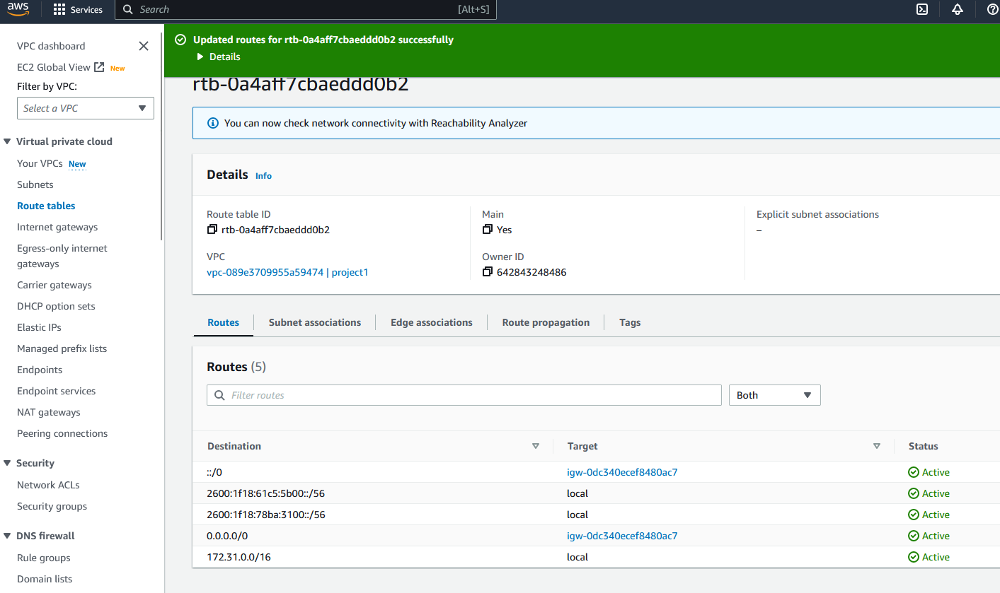
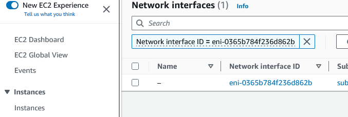

<br>
<br>

<div style="text-align: center;">
  
</div>

<br>
<br>
<br>

<div style="text-align: center;">
  <font size="5"><strong>Project Report</strong></font>
</div>

<br>
<br>
<br>

<div style="text-align: center;">
  <font size="5">Project: Digitalization SS 2023</font>
</div>
<br>
<div style="text-align: center;">
  <font size="6.9">IoT - From the Microcontroller to the Cloud</font>
</div>

<br>
<br>
<br>

<div style="text-align: center;">
  <font size="3"><em>by</em></font>
</div>
<br>
<br>
<div style="text-align: center;">
  <font size="4">Alexander Atanassov</font>
  <br>
  <font size="3"><em>and</em></font>
  <br>
  <font size="4">Binyam Tekeste</font>
</div>

<br>
<br>

<div style="text-align: center;">
  <font size="3"><strong>Supervisor</strong></font>
  <br>
  <font size="4">Prof. Dr. Oliver Hahm</font>
</div>

<br>
<br>

<div style="text-align: center;">
  <font size="3"><strong>Submission Date</strong></font>
  <br>
  <font size="4">July 28th, 2023</font>
</div>


<div style="page-break-after: always"></div>

**Table of Contents**

- [Overview](#overview)
- [Set Up](#set-up)
  - [Virtual Machine](#virtual-machine)
  - [Border Router](#border-router)
  - [Sensor Node](#sensor-node)
  - [Cloud](#cloud)
  - [User Interface](#user-interface)
- [Start System](#start-system)
- [Sources](#sources)


<div style="page-break-after: always"></div>

# Overview

**Project description:**

The goal of the project is to create a system where sensor data can be send from a microcontroller to a cloud. The data should be send every *x* seconds and must be stored at the cloud. Also a user interface should be implemented where the data can be visualized. The UI should run on any local PC. The user should also be able to send commands back to the sensor node (e.g. request the sensor data immediately).

**System architecture:**


<br>
The system consists of three main parts:

- The first part is responsible for sending the sensor data to the cloud. It consists of an *nrf52840dk* board which captures the data and send it to the cloud using MQTT-SN protocol, an *nrf52840dongle* as border router to route the packets and a Linux system which forward the packets.
- The second part is the cloud. It consists of a MQTT broker as a middleware between the sensor node and the backend script. The backend script is responsible for storing the data into a SQLITE database and sending it to the end user.
- The last part is the user interface which is a desktop program and can run on any PC with IPv6 connection.


# Set Up

In this chapter all of the system components will be explained. For each component there will also be a guide how to set it up.

## Virtual Machine

**Overview:**

For this project, a Linux operating system is required. It can be either be a host system or a guest system on a virtual machine. The machine on which Linux is running is used to forward IPv6 packets from the the sensor node to the cloud and back. It is also used for implementation tasks, connecting with the boards, monitoring the board terminal and debugging tasks. If a Linux system is already installed, the VirtualBox installation can be skipped. 

**Set up:**

The following steps will explain how to set up a Ubuntu virtual machine. After that, it will be explained what configurations have to be done and what software have to be installed.

***Virtual box and Ubuntu installation:***

1. Install [VirtualBox and the extension pack](https://www.virtualbox.org/wiki/Downloads).
2. Download an [Ubuntu Desktop](https://ubuntu.com/download/desktop) image.
3. Follow the [tutorial](https://www.geeksforgeeks.org/how-to-install-ubuntu-on-virtualbox/) to create a Ubuntu virtual machine.
4. Install the [Guest Additions](https://www.youtube.com/watch?v=zdkl16oAS1k&t=8s).

***Configurations and installations***

1. Allow IPv6 forwarding.
    - Open the file ```/etc/sysctl.conf```
    - Make sure that the forwarding is enabled
        ```
        net.ipv6.conf.all.forwarding=1
        ```
2. Set up a wireguard IPv6 connection
    - Install wireguard
        ```
        sudo apt install wireguard
        ```
    - Set up a new wireguard connection using e.g. Advanced Network Configuration
    - Add the connection details:
        ```
        [Interface]
        PrivateKey = ****************************************
        Address = 2001:470:7347:c200:1000::/64 

        [Peer]
        PublicKey = OzafSSqhtZDkHLgSIXY6a3n6Yi4EK9W3npfbWKA0VFc=
        AllowedIPs = ::/0 
        Endpoint = 176.9.132.254:51820
        PersistentKeepAlive = 60
        ```
3. To be able to flash programs on the boards, the following software has to be installed:
   - J-Link
   - gcc-multilib
   - arm-none-eabi-gcc
   - openocd
   - nrfjprog
   - nrf-udev
   - nrfutil

## Border Router

**Overview**

The border router is used to route packets between the sensor node and the Linux system. This component is necessary because the sensor node cannot directly send packets to the internet, since it is in a 6Lo network. It has two interfaces: A downstream to run 6LoWPAN and an IPv6 uplink. The border router program is based on the "gnrc_border_router" example program with small modifications to run it on a *nrf52840dongle*.


**Set up**

1. Make sure to set the path to the RIOT directory in the Makefile of the border router program.
   ```
   RIOTBASE ?= $<Path to RIOT>
   ```
2. Set the IPv6 prefix to the prefix of your network. Make sure to change the last two digits.
   ```
   IPV6_PREFIX ?= 2001:470:7347:c211::/64
   ```
3. Check the path to the serial port of the dongle.
   ```
   make list-ttys
   ```
4. Flash the program on a *nrf52840dongle*. Eg for port: "/dev/ttyACM0".
   ```
   PORT=/dev/ttyACM0 BOARD="nrf52840dongle" make all flash
   ```

## Sensor Node

**Overview**

The sensor node component is responsible for sending temperature values to the cloud. To do that, the *SAUL* module is used to read the current temperature from the build-in sensor. To send the data to the cloud, the MQTT-SN protocol is used. The temperature data is sent every *x* seconds by publishing the value on a topic called "temperature". The sensor node is also listening for commands from the user. For that, it is subscribed to a topic "requests" where a callback function checks the command and publish a temperature value immediately. To make sure that the temperature reading function is not called from the callback function and the publishing loop at the same time, it is synchronized using *mutex*. For the MQTT-SN client, EMCUTE module is used. 

**Set up**

1. Unlock the *nrf52840dk* board.
   ```
   nrfjprog --recover
   ```
2. Change the destination IPv6 address to the address of your EC2 instance.
   ```
   char * dest_addr = "<EC2 IPv6 address>";
   ```
3. The publishing interval can be changed here:
   ```
   xtimer_sleep(60);
   ```
4. Flash the program on a *nrf52840dk* board:
   ```
   PORT=/dev/ttyACM2 BOARD="nrf52840dk" make all flash
   ```

## Cloud

**Overview**

**Set up**

***Create EC2 instance***


After signing up, you have to put in your username and password and hit the log in button.


In the aws academy navigation you'll click on Modules and select Learner Lab.


In the Learner Lab environment click on the right side "Start Lab" and wait till the red button next to "AWS" on the left side turns green.


Click on "AWS" next to the green button and wait. If nothing happens, change your browser or check your ad blockers and settings.


On your first visit, click on Services and scroll down to E. Choose EC2. A other option would be to write EC2 in the search bar and choose it from there. After visiting the EC2 (Instances (running)) Page you can also click on EC2 under Recently visited.


Click on Instances (running)


Click on the yellow "Launch instances" button on the right top corner.


Give the instance a name


Select a Amazon Machine Image (AMI). 
For our project we used ubuntu.
Click the ubuntu option. 
Leave the Server and the Architecture as it is.


For the instance type, select the Free tier eligible version. Which is the t2.micro.

If you don't have a Key pair, click on "Create a new key pair" on the right side.
In the Window that will open, give the key pair a name.
Select RSA for the key pair type.
For the private file formate we used .pem so we could use OpenSSH.
If PuTTY is the preferred to use, choose .ppk
Click on the yellow button with the text "Create key pair" on it.
Choose a place to safe your key.
Choose the Key pair you created.


Leave the Network Settings as they are.


Set the configure storage to 30 GiB
Scroll down. Check the summary and click on the yellow button ("Launch instance") on the lower right corner.

The Instance will be shown under Instances after a little while. Under Status checked it might be shown as Initializing. After a while it will turn to 2/2 checks passed.


Click the checkbox next to the instance name.
In the lower part of the screen you will find the instance summary. 
Search for VPC ID and click on the ID.


On this page, click again on the VPC ID.


Click on the "Actions" button on the upper right corner and choose "Edit CIDRs".


Click on "Add new IPv6 CIDR


Select "Amazon-provided IPv6 CIDR block and click on "Select CIDR".


You should now see the status "Associated".
Click on the VPC ID on the top to see details to your VPC ID. 


Here you should see your IPv6.
Click on Route tables on the left side navigation bar.


In the lower part select the tier with the name "Routes" and click the button "Edit routes" on the right side.


Click "Add route" for the destination use ::/0 and for the target use your amazon default value. 
Click "Add route again and use the destination 0.0.0.0./0 if it is not already set. use the same default value as a target.
Save the changes with the click on the yellow button.
Click on "Route tables" at the top.



Our new routes are now shown in the lower part.
Click on Subnets


Click the checkbox next to the name. Click on the "Action" button on the upper right corner and select "Edit IPv6 CIDRs.


If the Subnet CIDR block is not already set, Click on "Add IPv6 CIDR" and save the changes by clicking the yellow button on the right lower corner.
Then go back to your instances screen.


Click the checkbox next to your instance and scroll further down on the lower part, till you see your Network interface click on the Interface ID.



Click the Network Interface ID again.


Click on the "Actions" button on the upper right corner and select "Manage IP addresses".


Click the button "Assign new IP address" in the IPv6 section.


After clicking the Assign button, leave it to Auto-assign and click the yellow "Save" button.


You wil end up at the Network interface summary page. Since your IPv6 addresses is not shown, click the page refreshing button.


The IPv6 addresses should now be visible.
Go back to your instances screen.


Click the checkbox next to your instance. On the lower part, click on the tier "Security". Click the link under "Security groups".


On the lower part, stay on the tier "Inbound rules" and click the button on the right "Edit inbound rules.


click on "Add rule".


Fill in the list above. (Some ports could be different for you).
After filling in all of them, click the yellow button "Save rules".
Go back to your instances screen.


Click on the checkbox next to your instance and click the "Connect button". 


On the first tier click on the yellow button "Connect".


Now your instance is connected.
Go back to the Connect to instance screen.


To be able to use multiple terminals of your instance, select the tier "SSH client". 
Copy the Example and use it in your Linux Ubuntu environment. To connect to your instance from a different terminal.

Your EC2 is established. 

***Installations***

1. Create a directory e.g. Project and navigate into it.
	```
	mkdir Project
	cd Project
	```
2. Install the Mosquito.RSMB broker. Follow the [Setting up a broker](https://github.com/RIOT-OS/RIOT/tree/master/examples/emcute_mqttsn) (Steps 1-3) tutorial.
3. Install SQLITE
	```
	sudo apt install sqlite3
	```
4. In the Project directory, create a database.
   ```
   sqlite3 mybase.db
   ```
5. Create a temperature table.
	```
	CREATE TABLE temperature (
    id INTEGER PRIMARY KEY AUTOINCREMENT,
    date TEXT,
    time TEXT,
    value INTEGER,
    scale INTEGER
	);
	```
	Type ```.exit``` to close sqlite3.
6. For the backend script, install the following libraries:
	- PAHO MQTT
		```
		pip install paho-mqtt
		```
	- FLASK
		```
		pip install Flask
		```
	- FLASK CORS
		```
		pip install flask-cors
		```
7. Change the address of the broker.
	```
	broker_address = "<IPv6 of the EC2 instance>"
	```
8. Enable port 1885 for incoming UDP IPv6 packets and set up a security rule.
9. Enable port 5000 for incoming TCP IPv6 packets and set up a security rule.


## User Interface

**Overview**

The user interface is a Desktop program which is used to visualize the stored data. The data is read from a database located at the cloud and is presented into a table. Also a temperature diagram can be created for the current day or the current month. The user can update the data or send a request to the sensor node via the cloud. Note, that new data is only received when clicking on the "Update" button. For the communication between the application and the cloud, HTTP protocol is used. Since for the communication IPv6 is used, the machine of the user has to have a IPv6 network connection. The Program itself is written in Python using the Tkinter library. 

**Set up**

1. Make sure that python is installed.
2. Install the following python libraries:
	- Tkinter
		```
		sudo apt-get install python3-tk
		```
	- Matplotlib
		```
		pip install matplotlib
		```
	- Resquests
		```
		pip install requests
		```
3. Change the address of the EC2 instance in the Client.py file.
	```
	self.base_url = "http://[<IPv6_Address>]:5000"
	```

# Start System

1. Open two terminals and connect with the EC2 instance via ssh.
2. In the first terminal start the Mosquitto RSMB broker.
   ```
   cd mosquitto.rsmb/rsmb/src
   
   ./broker_mqtts config.conf
   ```
3. In the second terminal start the backend script.
   ```
   python3 server.py
   ```
4. Start the border router.
   ```
   PORT=/dev/ttyACM0 BOARD="nrf52840dongle" make term
   ```
5. Start the sensor node.
   ```
   PORT=/dev/ttyACM2 BOARD="nrf52840dk" make all flash term
   ```
   If it is already running restart it or reflash it.
   ```
   PORT=/dev/ttyACM2 BOARD="nrf52840dk" make reset
   ```
6. Start the user interface.
   ```
   python3 Application.py
   ```
- Note: If some of the components throw errors, it might help to restart them.

# Sources

- RIOT documentation: https://doc.riot-os.org/
- RIOT Github Repository: https://github.com/RIOT-OS/RIOT 
- Tkinter: https://www.pythontutorial.net/tkinter/tkinter-mvc/ 
- Flask: https://flask.palletsprojects.com/en/2.3.x/ 
- Paho: http://www.steves-internet-guide.com/into-mqtt-python-client/ 
